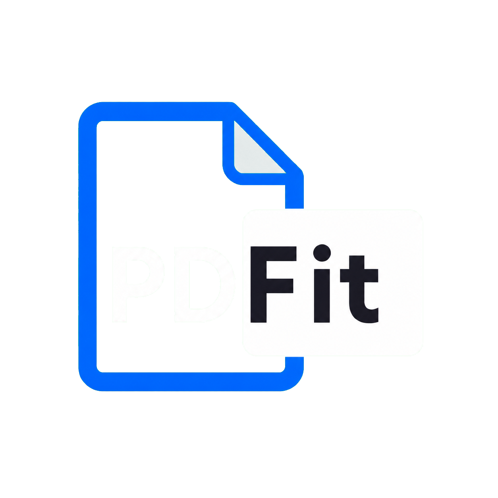

# PDFit

[한국어](README_kor.md) · **English**

> A fast, self-hosted PDF library and reader with WebGPU rendering, visual bookmarks, folders, tags, reading progress, and AI-ready metadata.

<p align="center">
  
</p>

PDFit turns a PDF collection into a searchable reading workspace. The public
repository contains the local-volume product in `apps/pdfit` and runs as a
single local Docker service.

[](docker-compose.yml)
[](packages/pdfit/src/front/components/PdfGpuViewer)

## What it looks like


The screenshot is captured from the deployed Docker service and shows the integrated library shell with folder counts, tag summaries, and Settings navigation.

The brand mark is the same compact transparent PNG used by the service header and favicon. It represents a blue PDF document with `PD` in white and a compact white `Fit` panel in black.

## Why PDFit?

- **Read your own library** — use a mounted local, USB, SMB, or Docker-managed collection without uploading books to a third-party service.
- **Fast first screen** — the library shell renders before PDF.js and viewer-only code warm in the background.
- **GPU-accelerated reading** — the shared viewer uses PDFium/WebGPU with a browser fallback path.
- **Metadata that stays with the library** — folders, tags, progress, and viewer state are stored in PostgreSQL.
- **Useful organization** — browse folders and tags, open the complete book list for a folder, and keep reading state across sessions.
- **Visual bookmarks** — drag a page region to save a high-resolution JPEG capture with absolute PDF coordinates, border/fill color, opacity, and comments. The overlay follows zoom, scroll, page changes, and two-page layout changes.
- **Bookmark workspace** — review recent or book-grouped captures, preview the original image, jump to its page, edit colors/comments, and delete from the library or viewer.
- **AI-ready foundation** — configure AI servers and pgvector from the same Settings surface.
- **Local-first deployment** — the public checkout keeps the local/USB/SMB contract and does not require an account or remote storage service.

## Quick start

Requirements: Node.js 20 or newer with npm, and Docker Desktop (or Docker Engine) with Compose. PDFit runs as a single Docker service; npm installs the launcher that prepares and starts that service.

### Install with npm

Install the released launcher directly from the GitHub repository with npm:

```bash
npm install https://github.com/hikaMaeng/PDFit.git#v0.4.3
```

After installation, run the launcher with `npx`:

```bash
npx pdfit
```

The launcher then asks for the root folder of your PDF library. You can also provide the folder directly:

```bash
npx pdfit /path/to/pdfs
```

On Windows, use a Windows path such as `D:\\Books` or `S:\\pdf-library`. On macOS and Linux, use a path such as `/Users/me/Books` or `/mnt/library`. Docker mounts the selected host folder at `/app/data/books`; PDFit does not copy, upload, or delete your PDF files.

After the launcher starts the Docker service:

1. Open [http://127.0.0.1:15201](http://127.0.0.1:15201) in your browser.
2. Select **Refresh** in the library sidebar when you want PDFit to scan the mounted folder.
3. Browse folders, assign tags, and open a PDF to use the WebGPU/PDFium reader.
4. Use the **Bookmarks** section for visual page captures and saved reading notes.

To see all launcher options, run:

```bash
npx pdfit --help
```

To use a different release, replace `v0.4.3` in the install command with the desired Git tag.

### Install from a source checkout

For development or local source changes, clone the repository and install its npm workspace dependencies:

```bash
git clone --branch v0.4.3 https://github.com/hikaMaeng/PDFit.git
cd PDFit
npm install
npm run deploy
```

Open [http://127.0.0.1:15201](http://127.0.0.1:15201).

The repository Compose contract mounts the configured library into `/app/data/books`. Set the host library/volume values in the repository's local environment before deploying; do not commit credentials or host-specific paths.

Bookmark images are not stored in PostgreSQL as Base64. Base64 is the capture
transport between the viewer and server; the server converts it to a quality-90
JPEG under the bookmark volume at `/app/data/bookmarks/<bookmark-id>/capture.jpg`.
Bookmark metadata, coordinates, colors, opacity, comments, and timestamps remain
in PostgreSQL. Deleting a bookmark removes both records and its JPEG asset.

## Development commands

| Command | Purpose |
| --- | --- |
| `npm run build` | Build the shared package and integrated app |
| `npm run deploy` | Build locally and recreate the Docker service |
| `npm run verify:repo` | Check repository and Compose contracts |
| `npm run verify:pdfit` | Verify the integrated app, APIs, Settings, and viewer artifacts |
| `npm run verify:pdfit:acceptance` | Run the PDFit acceptance matrix |
| `npm run test:pdfgpu` | Run the PDFGPU integration check |

Use `npm run deploy` as the Docker entrypoint. The runtime image copies the prebuilt `apps/pdfit/dist` artifact; it does not build the project inside Docker.

## Architecture at a glance

```text
apps/pdfit                  Existing local-library service and viewer on port 15201
        │
        └── packages/pdfit   Shared React UI, viewer, routes, PostgreSQL adapters
```

The browser service and dedicated `/viewer` entry share the same app, metadata, data root, and release version.

## Documentation

- [Workspace and architecture](docs/01-workspace-overview.md)
- [Architecture and boundaries](docs/02-architecture-and-boundaries.md)
- [Build, deploy, and Compose](docs/03-build-deploy-and-compose.md)
- [Runtime contract](docs/04-runtime-contract.md)
- [Data and migration contract](docs/05-migration-and-data-contract.md)
- [Verification and evidence](docs/08-verification-and-evidence.md)
- [Integrated app documentation](apps/pdfit/README.md)

## Project status

PDFit is actively evolving. The current repository is optimized for the integrated Docker deployment and keeps refresh/indexing explicit so opening the app does not unexpectedly scan a large or network-backed library.
